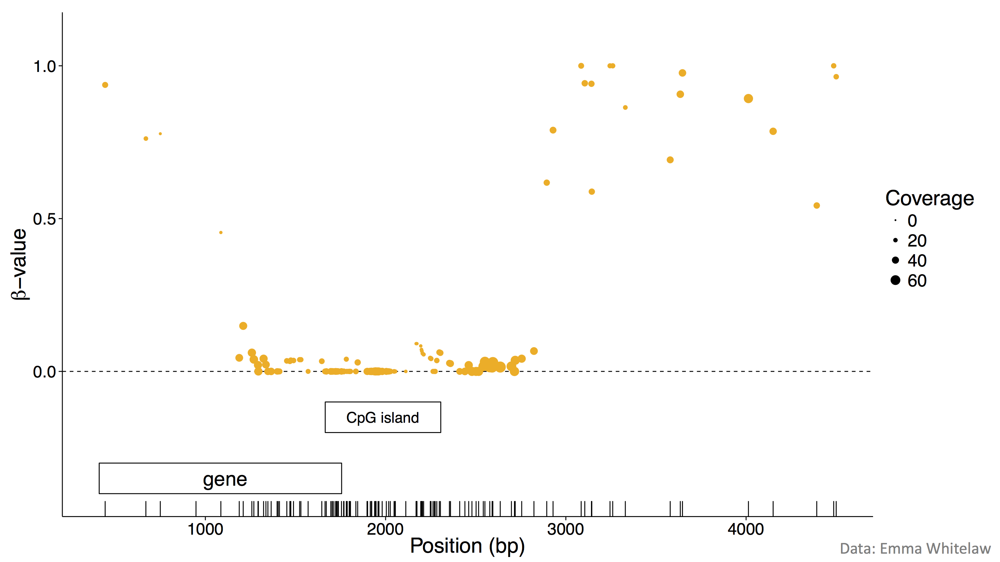
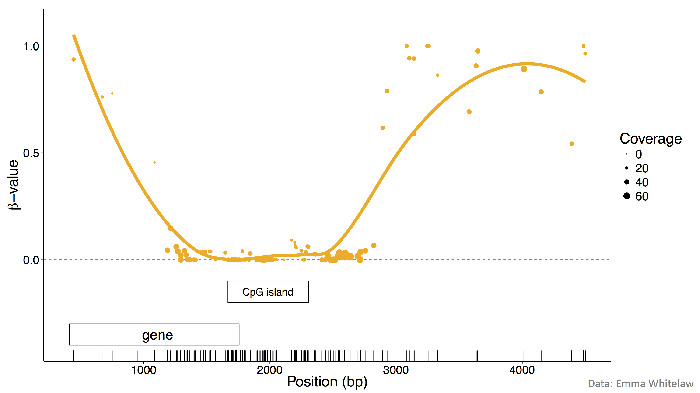
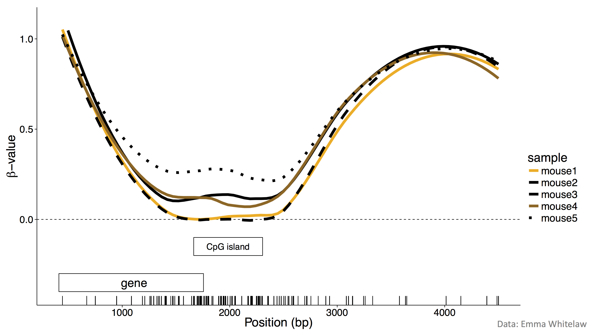
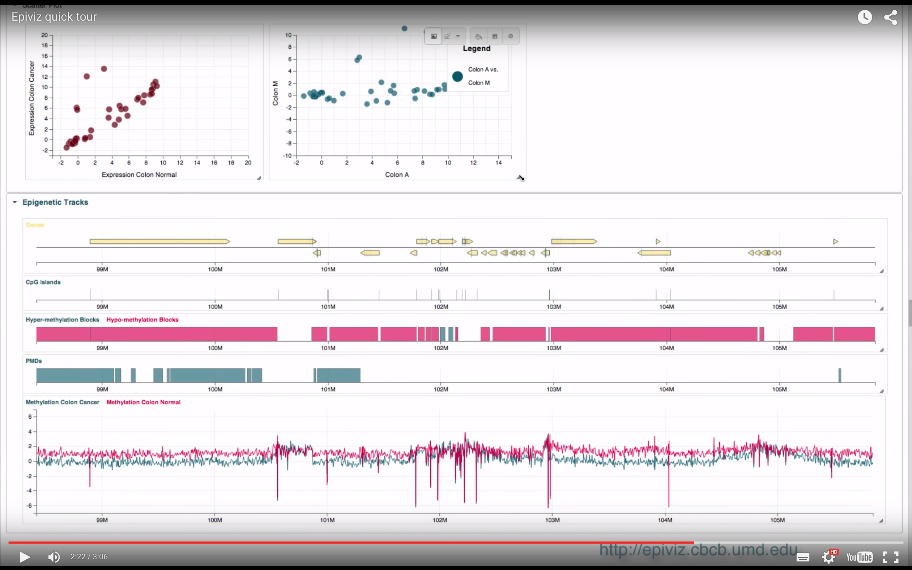

```{r setup, include = FALSE}
knitr::opts_chunk$set(echo = FALSE, comment = "#>")
library(biocViews)
library(BiocInstaller)
```

## Basic biology {.smaller}

<center></center>

Modified "<a href="https://commons.wikimedia.org/wiki/File:Cytosine_becomes_thymine.png#/media/File:Cytosine_becomes_thymine.png">Cytosine becomes thymine</a>" by <a href="//commons.wikimedia.org/wiki/User:CFCF" title="User:CFCF">CFCF</a> - <span class="int-own-work" lang="en">Own work</span>. Licensed under <a href="http://creativecommons.org/licenses/by-sa/3.0" title="Creative Commons Attribution-Share Alike 3.0">CC BY-SA 3.0</a> via <a href="//commons.wikimedia.org/wiki/">Wikimedia Commons</a>.

## Basic biology {.smaller}

<center></center>

[http://episona.com/wp-content/uploads/2014/01/Agouti-Mouse-1024x802.jpg
](http://episona.com/wp-content/uploads/2014/01/Agouti-Mouse-1024x802.jpg
)

## Basic biology {.smaller}

<center></center>

[Figure S7.1C, Integrated genomic analyses of ovarian carcinoma, TCGA, doi:10.1038/nature10166](www.nature.com/articles/nature10166)

<div class = "notes">
Figure S7.1C. Scatterplots showing AMT gene expression versus promoter methylation. The color and size of the dots represent tissue type (red/large – fallopian tube samples, n=8; black/small – ovarian tumors, n=489). 
</div>

## Sodium bisulfite treatment of DNA {.flexbox .vcenter .build}

<center></center>

[Adapted from Krueger, F., et al., Nat. Methods 9, 145–151 (2012).](http://www.ncbi.nlm.nih.gov/pubmed/22290186)

# Assays

## Bisulfite-based assays {.build}

Going to focus on contemporary high-throughput assays based on __sodium bisulfite treatment of DNA__

### Microarrays

- Illumina 27k
- Illumina 450k

### Sequencing

- Whole-genome bisulfite-sequencing (WGBS/BS-seq/methylC-seq)
- (Enhanced/Extended) Reduced representation bisulfite-sequencing (eRRBS/RRBS)
- Capture + bisulfite-sequencing (Roche SeqCap Epi system)
    
## Non-bisulfite assays

Based on an enrichment/pulldown of methylated DNA and/or restriction enzymes

- **Me**thylated DNA **i**mmuno**p**recipitation + microarray/sequencing (MeDIP-microarray/MeDIP-seq/mDIP-seq)
- **M**ethylation-sensitive **r**estriction **e**nzyme + sequencing (MRE-seq)
- **M**ethyl **b**inding **d**omain protein-enrichment + sequencing (MBD-seq)

## The analysis pipeline

Most assay-specific:

- Getting data into R
- Pre-processing
- Analysis

Somewhere in between:

- Batch effects

Less assay-specific:

- Visualisation
- Data integration

## How can Bioconductor help?

```{r methylation-bioc-pkgs, warning = FALSE, cache = TRUE}
data("biocViewsVocab")
# Get all biocViews
bioc_views <- lapply(X = BiocInstaller::biocinstallRepos()[1:4],
                     FUN = biocViews::getBiocViews,
                     vocab = biocViewsVocab,
                     defaultView = "NoViewProvided")
dna_methylation <- lapply(X = bioc_views,
                          FUN = function(bcv) bcv$DNAMethylation@packageList)
```

Bioconductor `r BiocInstaller::biocVersion()` packages (based on DNAMethylation [_BiocViews_](http://www.bioconductor.org/packages/release/BiocViews.html)):

> - `r length(dna_methylation[["BioCsoft"]])` software packages
> - `r length(dna_methylation[["BioCann"]])` annotation packages

## Disclaimer {.build}

__I can't tell you everything__

- 25 minutes
- I don't know everything!

__Will tell you:__

- What I find useful as a fairly well-experienced user & developer
- What I am most familiar with
- Where to find out more

# Microarrays

## Description of assays {.smaller .build}

### What these measure

- Red + green fluorescence intensities reflecting methylated and unmethylated signal

<div class="columns-2">

### [Illumina 27k](https://en.wikipedia.org/wiki/Illumina_Methylation_Assay)

- Infinium HumanMethylation27 BeadChip
- ~28,000 cytosines
- Mostly in promoters of ~15,000 genes
- Infinium I probes
- Deprecated? But much of TCGA data uses this platform. 

### [Illumina 450k](http://www.illumina.com/products/methylation_450_beadchip_kits.html)

- Infinium HumanMethylation450 BeadChip
- ~486,000 cytosines
- Promoters, gene bodies, 3' UTR, intergenic
- 135k Infinium I and 350k Infinium II probes
- [An overview of 450k technology](http://www.biostat.jhsph.edu/~lcollado/misc/genomics/GWG_JPF.pdf)

</div>

## Key packages

### Powerhouses

- [_minfi_](http://bioconductor.org/packages/minfi/)
- [_methylumi_](http://bioconductor.org/packages/methylumi/)

### Pipelines

- [_ChAMP_](http://bioconductor.org/packages/ChAMP/)
- [_RnBeads_](http://bioconductor.org/packages/RnBeads/)

## Data ingest

### File formats

- `.idat` files
- Files returned by Illumina's BeadStudio

### [_minfi_](http://bioconductor.org/packages/minfi/)

- `read.450k()`, `read.450k.exp()`, `read.450k.sheet()`
- `readTCGA()`
- `readGEORawFile()`

## Pre-processing

__Very important__

See [A comprehensive overview of Infinium HumanMethylation450 data processing (2013)](http://bib.oxfordjournals.org/content/15/6/929.long), [minfi User's Guide](http://www.bioconductor.org/packages/release/bioc/vignettes/minfi/inst/doc/minfi.pdf)

## Quality control

<div class="columns-2">

### Static

- `minfi::qcReport()`, `minfi::minfiQC()`
- [_skewr_](http://bioconductor.org/packages/release/bioc/html/skewr.html)

### Interactive

- [_MethylAid_](http://bioconductor.org/packages/release/bioc/html/MethylAid.html)
- [_shinyMethyl_](http://bioconductor.org/packages/shinyMethyl/)


</div>

## Pre-processing {.build}

### Standard microarray issues

- Failed probes
- Cross-reactive probes
- Background correction
- Colour (dye) bias adjustment
- Normalisation

### 450k-specific issues

- Type I and II probes are very different
- CpG-SNPs

### Methylation-specific(ish) issues

- Cell composition artefacts

## Pre-processing {.build}

- Several pre-processing options available in Bioconductor packages and some comparisons published e.g., [wateRmelon](http://bioconductor.org/packages/wateRmelon/)

### Tools

- [_minfi_](http://bioconductor.org/packages/minfi/)
    - `detectionP()`
    - `preprocessRaw()`, `preprocessIllumina()`, `preprocessQuantile()`, `preprocessNoob()`,  `preprocessSWAN()`, `preprocessFunnorm()`
    - `dropLociWithSnps()`
    - `estimateCellCounts()`
- [_RUVm_ (remove unwanted variation)](http://www.bioconductor.org/packages/release/bioc/vignettes/missMethyl/inst/doc/missMethyl.pdf) implemented in [_missMethyl_](http://bioconductor.org/packages/missMethyl/)
- [_CopyNumber450k_](http://bioconductor.org/packages/CopyNumber450k/)

## Downstream analyses {.build}

### $\beta$-values vs. $\mathcal{M}$-values

$\beta = \frac{M}{M + U + 100} \in [0, 1]$

$\mathcal{M} = \log(\frac{M + 1}{U + 1}) \in [-\infty, \infty]$

[Du, P. et al. Comparison of Beta-value and M-value methods for quantifying methylation levels by microarray analysis. BMC Bioinformatics 11, 587 (2010).](http://www.ncbi.nlm.nih.gov/pmc/articles/PMC3012676/):

> "We recommend using the $\mathcal{M}$-value method for conducting differential methylation analysis and including the $\beta$-value statistics when reporting the results to investigators."

## Differential methylation {.build}

### Differentially methylated probes (DMPs)

- For a given probe, are the group-average level(s) of methylation different?
- [_limma_](http://bioconductor.org/packages/limma/) is the workhorse, e.g., `minfi::dmpFinder()`
- __OPINION__: You want a pretty good reason not to use a _limma_-based approach

### Differentially methylated regions (DMRs)

- Identify _regions_ with different group-average level(s) of methylation
- __OPINION__: DMR finding/testing is somewhat _ad hoc_, but getting better
- E.g., see `minfi::blockFinder()` with the `bumphunter::bumphunter()` backend

## Differential variability

- For a given probe, are the within-group variances of methylation levels different?
- `missMethyl::varFit`, `missMethyl::topVar()` based on [_limma_](http://bioconductor.org/packages/limma/)

# Sequencing

## Description of assays

## Description of assays {.smaller .build}

### What these measure

Single-base resolution of cytosine methylation

### Whole-genome bisulfite-sequencing

- Gold standard
- Genome-wide assay
- Expensive
- 2-30x sequencing coverage

### Targeted bisulfite-sequencing

- Reduce representation bisulfite-sequencing and SeqCap
- Cheaper
- 20-60x sequencing coverage

## Key packages {.build}

Still being figured out ...

[__Review__: Robinson, M. D. et al. Statistical methods for detecting differentially methylated loci and regions. Front. Genet. 5, 324 (2014).](http://www.ncbi.nlm.nih.gov/pubmed/25278959)

There are also non-R/Bioconductor options

### __OPINION__

- [_bsseq_](http://bioconductor.org/packages/bsseq/) for whole-genome bisulfite-sequencing
- [_BiSeq_](http://bioconductor.org/packages/BiSeq/) for reduced representation bisulfite-sequencing
- [_RnBeads_](http://bioconductor.org/packages/BiSeq/) for comprehensive WGBS/RRBS pipeline

## Non-R preliminaries {.build}

### Pipeline (including most pre-processing)

- Data QC (e.g., [FastQC](http://www.bioinformatics.babraham.ac.uk/projects/fastqc/))
- Read trimming (e.g., [Trim Galore!](http://www.bioinformatics.babraham.ac.uk/projects/trim_galore/))
- Read alignment (e.g., [bismark](http://www.bioinformatics.babraham.ac.uk/projects/bismark/), [bwa-meth](https://github.com/brentp/bwa-meth))
- Methylation calling (e.g., aligner-supplied software, [_Bis-SNP_](http://www.genomebiology.com/2012/13/7/R61), [_methtuple_](https://github.com/PeteHaitch/methtuple))

### Input to Bioconductor

- Some aligner-specific file format with the following data per-sample:

```
chr  pos M  U
chr7 666 13 2
chr7 685 12 0
```

## Pre-processing {.build}

- Most done prior to reading data into R
- More that ought to probably be done

### Some issues

- CpGs overlapping genetic variants
- Copy number variation
- Normalisation (nothing much yet available)

## Smoothing $\beta$-values {.smaller}

<center></center>

__Cartoon__ (see e.g., `bsseq::BSmooth()` for a proper implementation)

## Smoothing $\beta$-values {.smaller}

<center></center>

__Cartoon__ (see e.g., `bsseq::BSmooth()` for a proper implementation)

## Differentially methylated regions

<center></center>

__Cartoon__ (see e.g., `bsseq::BSmooth.tstat()` and `bsseq::dmrFinder()` for a proper implementation)

## Differentially methylated regions

<center></center>

__Cartoon__ (see e.g., `bsseq::BSmooth.tstat()` and `bsseq::dmrFinder()` for a proper implementation)

## Other downstream analyses

### Epigenome segmentation

- [_MethylSeekR_](http://bioconductor.org/packages/MethylSeekR/)

### Using methylation patterns

- [Methylation entropy](http://www.ncbi.nlm.nih.gov/pubmed/21278160)
- [Allele-specific methylation](http://www.ncbi.nlm.nih.gov/pubmed/22523239)
    - Most methods based on SNPs rather than methylation patterns
- [Epialleles](http://www.ncbi.nlm.nih.gov/pubmed/25260792)
    - [_MPFE_](http://bioconductor.org/packages/MPFE/)
    - [_MethylationTuples_ (https://github.com/PeteHaitch/MethylationTuples)](https://github.com/PeteHaitch/MethylationTuples)
    
# General issues

## Batch effects and unwanted variation

__Yes, they affect DNA methylation data__

- [Introduction to batch effects](http://www.ncbi.nlm.nih.gov/pubmed/20838408)

### Methods better developed for microarray methylation data

- [_sva_](http://bioconductor.org/packages/sva/): General methods for removing batch effects and other unwanted variation in high-throughput experiments.
- [_missMethyl_](http://bioconductor.org/packages/sva/): Includes `RUVadj()` and `RUVfit()` specific to 450k data.

### Cell-type heterogeneity

- [Jaffe, A. E. & Irizarry, R. A. Accounting for cellular heterogeneity is critical in epigenome-wide association studies. Genome Biol. 15, R31 (2014).](http://www.ncbi.nlm.nih.gov/pubmed/24495553)
    - [_RnBeads_](http://bioconductor.org/packages/RnBeads/): See [vignette](http://www.bioconductor.org/packages/release/bioc/vignettes/RnBeads/inst/doc/RnBeads.pdf) for 

## Visualisation: [_coMET_](http://bioconductor.org/packages/coMET/)

<center></center>

## Visualisation: [_epivizr_](http://bioconductor.org/packages/epivizr/)

<center></center>

[http://bit.ly/epivizr (YouTube intro)](http://bit.ly/epivizr)

## Data integration

Check out [_AnnotationHub_](http://bioconductor.org/packages/AnnotationHub/)

## Summary {.build}

- Bioconductor contains many packages for analysing DNA methylation data
    - Explore these using [BiocViews](http://www.bioconductor.org/packages/release/BiocViews.html)

### Microarray

- Analysis pipeline is well-established
- __OPINION__: Start with [_minfi_](http://bioconductor.org/packages/minfi/)

### Sequencing

- More work done outside of R/Bioconductor
    - __OPINION__: Move to Bioconductor for exploratory data analysis, inference, visualisation, and integration.
    
### Technical biases are rife

- Careful experimental design and a skeptical mind are key

## Links

__TODO__

- Workflows
- Package vignettes
- These slides
- Conferences (e.g., http://webspace.qmul.ac.uk/rlowe/450kworkshop//index.html)
- [PH525x series - Biomedical Data Science](http://genomicsclass.github.io/book/)
- [A comprehensive overview of Infinium HumanMethylation450 data processing](http://www.ncbi.nlm.nih.gov/pmc/articles/PMC4239800/)
- [Evaluation of the Infinium Methylation 450K technology](http://www.ncbi.nlm.nih.gov/pubmed/22126295)
- [Validation of a DNA methylation microarray for 450,000
CpG sites in the human genome (pdf)](http://www.tandfonline.com/doi/pdf/10.4161/epi.6.6.16196)
- [https://www.coursera.org/course/genbioconductor](https://www.coursera.org/course/genbioconductor)

# Notes

## Warning 

__WARNING: The remaining 'slides' are notes and are not part of the presentation__

## Manual package curation (BioC 3.1)

## Microarrays {.smaller}

- BEclear (batch effects)
- ChAMP
- charm
- COHCAP (+ BS-seq)
- conumee
- CopyNumber450k
- DMRcate
- DMRforPairs
- ENmix
- lumi
- MethylAid
- MethylMix
- methylumi
- minfi
- missMethyl
- shinyMethyl
- skewr
- wateRmelon

## Sequencing {.smaller}

- BiSeq
- bsseq
- DMRcaller
- DSS
- M3D
- methylPipe
- MethylSeekR
- MPFE

### Misc. {.smaller}

- bumphunter (general)
- coMET (visualisation of EWAS and 'co-methylation LD maps')
- MassArray (sequenom)
- MEDIPS (MeDIP-seq)
- MEDME (MeDIP-microarray)
- methVisual (clone BS-seq)
- methyAnalysis (mostly arrays with some seq, same dev as lumi)
- methylMnM (MeDIP-seq and MRE-seq)
- Repitools (MeDIP-seq)
- RnBeads (slick pipeline run with "modules", builds on other packages)
